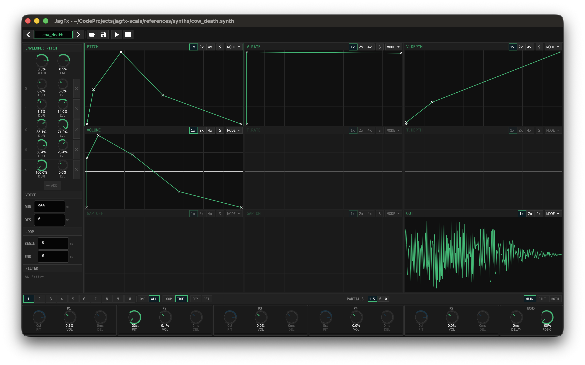

# JagFX - Jagex Synth Editor

<p align="left">
  
</p>

Cross-platform editor for Jagex Audio Synthesis (`.synth`) files. Create, edit, visualize, and export OldSchool RuneScape sound effects.

## Features

| Category | Description |
|----------|----------|
| **Envelopes** | Pitch, Volume, Vibrato (Rate/Depth), Tremolo (Rate/Depth), Gate (Silence/Duration) |
| **Partials** | 10 additive partials with volume, decicent offset, and time delay |
| **Filter** | IIR filter with pole/zero editor, frequency response visualisation |
| **Modulation** | FM (vibrato) and AM (tremolo) with envelope-controlled rate/depth |
| **Echo** | Configurable echo delay and mix level per voice |
| **Export** | Save as `.synth` or export to `.wav` (8-bit or 16-bit) |

## Installation

Requires .NET 8.0 SDK or later.

```bash
# clone this repository
git clone https://github.com/xsyetopz/JagFX.git
cd jagfx-scala

# build everything (incl. external-ish libs)
dotnet build
```

## Quick Start

```bash
# run CLI application
dotnet run --project JagFX.CLI --framework net8.0

# run XUnit tests
dotnet test
```

## Usage

### Converting .synth to .wav

```bash
# positional args
dotnet run --project JagFX.CLI --framework net8.0 -- input.synth output.wav

# specify loop count (optional)
dotnet run --project JagFX.CLI --framework net8.0 -- input.synth output.wav 4

# flag args
dotnet run --project JagFX.CLI --framework net8.0 -- -i input.synth -o output.wav
dotnet run --project JagFX.CLI --framework net8.0 -- -i input.synth -o output.wav -l 4
```

### Inspecting .synth files

```bash
dotnet run --project JagFX.CLI --framework net8.0 -- inspect input.synth
```

## Building for Distribution

### Self-Contained Executable

Build a single executable for your platform:

```bash
# Windows (Intel/AMD)
dotnet publish -c Release -r win-x64 --self-contained -o publish/win-x64

# Linux (Intel/AMD)
dotnet publish -c Release -r linux-x64 --self-contained -o publish/linux-x64

# macOS (Intel)
dotnet publish -c Release -r osx-x64 --self-contained -o publish/osx-x64

# macOS (Apple Silicon)
dotnet publish -c Release -r osx-arm64 --self-contained -o publish/osx-arm64
```

### Framework-Dependent

```bash
dotnet publish -c Release -o publish
```

## Examples

### `ice_cast.synth` and `ice_barrage_impact.synth`

<https://github.com/user-attachments/assets/b0564501-5d82-4239-8883-b32ab746e7dc>

## Contributing

Contributions welcome. Feel free to open issues or submit pull requests.

## License

MIT - see [LICENSE](LICENSE) file for details.

## Acknowledgments

[Lost City](https://github.com/LostCityRS) - Different client versions of `.synth` files

[OpenOSRS](https://github.com/open-osrs/runelite/tree/master/runescape-client) - Decompiled and partially deobfuscated files related to `.synth` format and IIR filter
