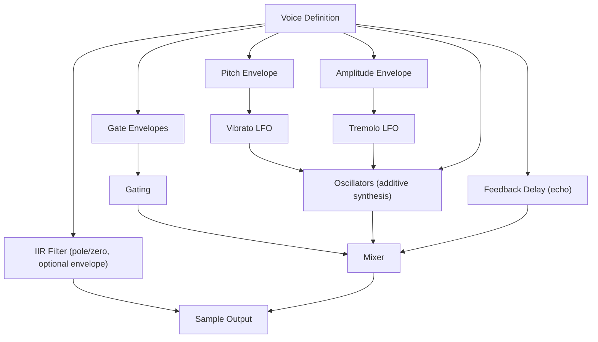

# Jagex .synth File Format Specification

Formal specification based on C# implementation (JagFX).

## Overview

Binary format for synthesized sound effects used in OldSchool RuneScape. Contains up to **`10` voices** with envelope-controlled pitch, amplitude, LFO modulation, and optional IIR filtering.

- **Byte Order**: Big Endian
- **Sample Rate**: `22,050` Hz (fixed)
- **Max Voices**: `10`
- **Max Oscillators per Voice**: `10`
- **Fixed-Point Scale**: `65,536` (16.16 format)

---

## Data Types

| Type | Size | Description |
|------|------|-------------|
| `u8` | `1` byte | Unsigned 8-bit integer |
| `u16` | `2` bytes | Unsigned 16-bit integer (big-endian) |
| `s32` | `4` bytes | Signed 32-bit integer (big-endian) |
| `smart` | `1-2` bytes | Signed variable-length integer. Values `-64` to `63`: encoded as `val + 64` in `1` byte. Values outside this range: 2-byte encoding. |
| `usmart` | `1-2` bytes | Unsigned variable-length integer. Values `0`-`127`: encoded as `val` in `1` byte. Values `128`-`65535`: 2-byte encoding with high bit set. |

---

## File Structure

```text
[Voice 0..9]        - Up to 10 voices, empty slots marked with 0x00
[Loop Parameters]   - 4 bytes (optional, may be truncated)
```

### Format Revisions

- **Rev245** (2004-07-13): Compact layout without padding
- **Rev377** (2006-05-02): Introduces `0x00` padding between voices

Parser detects format automatically and applies compatibility patches.

---

## Voice Structure

Each voice begins with **marker byte**:

- `0x00`: Empty slot (consume `1` byte, advance to next)
- `1`-`4`: Voice present (marker = Waveform ID of Pitch Envelope's waveform)
- Any other value: Invalid marker - treat as empty, skip `1` byte, continue

**Minimum size**: Voice occupies at least `30` bytes. If fewer bytes remain, voice slot is treated as empty.

### Voice Fields

| Field | Type | Description |
|-------|------|-------------|
| **Pitch Envelope** | Envelope | Frequency trajectory over time |
| **Amplitude Envelope** | Envelope | Volume trajectory over time |
| **Vibrato LFO** | Optional Pair | Pitch modulation (Rate + Depth) |
| **Tremolo LFO** | Optional Pair | Amplitude modulation (Rate + Depth) |
| **Gate Envelopes** | Optional Pair | Silence + Duration control |
| **Oscillators** | Oscillator[] | Additive synthesis sources (amplitude-`0` terminated, max `10`) |
| **Echo Delay** | usmart | Echo feedback buffer delay (ms) |
| **Echo Mix** | usmart | Echo dry/wet balance (`0`-`100`%) |
| **Duration** | u16 | Total voice duration (ms) |
| **Start Time** | u16 | Delay before voice starts (ms) |
| **Filter** | Filter | Optional IIR filter (see below) |

### Optional Pair Detection

Peek next byte:

- `0x00`: Consume 1 byte, pair is absent
- `!= 0x00`: Read two Envelopes (Rate then Depth)

---

## Envelope Structure

| Field | Type | Description |
|-------|------|-------------|
| **Waveform** | u8 | `0`=Off, `1`=Square, `2`=Sine, `3`=Saw, `4`=Noise |
| **Start** | s32 | Initial value (fixed-point) |
| **End** | s32 | Final value (fixed-point) |
| **Segment Count** | u8 | Number of envelope segments |
| **Segments** | Segment[] | Linear interpolation points |

### Segment Structure

| Field | Type | Description |
|-------|------|-------------|
| **Duration** | u16 | Time to reach peak (ms) |
| **Peak** | u16 | Target value at segment end |

**Note**: `Segment.Peak` (`0`-`65535`) maps to linear interpolation progress between `Start` and `End` values.

**Envelope synthesis**: If envelope has zero segments but `Start != End`, parser synthesises implicit segment spanning full voice duration with `peak = End`.

---

## Oscillator Structure

Read up to `10` oscillators. Each entry begins with amplitude field:

| Field | Type | Description |
|-------|------|-------------|
| **Amplitude** | usmart | Relative volume (percentage) |
| **Pitch Offset** | smart | Fine pitch adjustment (decicents) |
| **Delay** | usmart | Time before oscillator starts (ms) |

**Termination**: When decoded `Amplitude` value equals `0`, stop reading oscillators. Because `0` encodes as `0x00` in `usmart` format, this is equivalent to first byte being `0x00`.

---

## Filter Structure

IIR filter with configurable poles. Format supports up to `15` pole pairs per channel (packed into `4` bits), though typical files use `1`-`4` pairs.

**Detection**: Peek next byte before reading:

- `0x00`: No filter, consume `1` byte and skip.
- `1`-`4` AND remaining buffer is large enough AND bytes `1`-`8` look like plausible envelope start/end (`s32` in range `±10,000,000`) with valid segment count (byte `9` ≤ `15`): treat as next voice marker, not filter.
- Otherwise: filter is present.

| Field | Type | Description |
|-------|------|-------------|
| **Channel Config** | u8 | Packed: `Count0 = byte >> 4`, `Count1 = byte & 0x0F`. If `0x00`, no filter. |
| **Unity Gain Ch0** | u16 | Gain for channel `0` |
| **Unity Gain Ch1** | u16 | Gain for channel `1` |
| **Modulation Mask** | u8 | Bit flags: `bit (ch*4 + p)` set means pole `p` of channel `ch` has distinct phase-1 coefficients. Covers at most `4` poles per channel (bits `0`-`3` = ch0, bits `4`-`7` = ch1). |

### Phase-0 Coefficients (Baseline)

For each channel (`0`, then `1`) with `Count > 0`, read `Count` pairs:

| Field | Type | Description |
|-------|------|-------------|
| **Frequency** | u16 | Pole center frequency |
| **Magnitude** | u16 | Pole magnitude (resonance) |

### Phase-1 Coefficients (Modulated Poles)

For each channel, for each pole: if corresponding `Modulation Mask` bit is set, read new pair; otherwise pole's phase-1 values are copies of its phase-0 values (not stored in file).

| Field | Type | Description |
|-------|------|-------------|
| **Frequency** | u16 | Phase-1 pole frequency |
| **Magnitude** | u16 | Phase-1 pole magnitude |

### Filter Envelope

Read **only if** `Modulation Mask != 0` **or** `Unity Gain Ch0 != Unity Gain Ch1`:

| Field | Type | Description |
|-------|------|-------------|
| **Segment Count** | u8 | Number of segments |
| **Segments** | Segment[] | Filter coefficient modulation over time |

---

## Example: Complex Filter Structure

This file `ice_cast_rev377.synth` (`331` bytes) demonstrates voice with maximum filter complexity:

```text
Voice 0:
├── Pitch Envelope (sine, 5 segments, 40→2000)
├── Volume Envelope (off, 5 segments, 0→100)
├── Vibrato: none
├── Tremolo: none
├── Gate Envelopes (present: 5+4 segments)
├── 4 Oscillators (vol: 70, 150, 1024, 7602)
├── Echo (delay=24329ms, mix=66%)
├── Duration=36610ms, Start=0ms
└── Filter (15 pairs per channel!)
    ├── Channel Config: 0xFF (Count0=15, Count1=15)
    ├── Unity Gains: 65535, 65535
    ├── Modulation Mask: 0xFF (poles 0-3 of ch0 + poles 0-3 of ch1 = 8 modulated)
    ├── Phase-0 coefficients: 30 pairs (freq+mag for all 30 poles)
    ├── Phase-1 coefficients: 8 pairs (only for 8 modulated poles)
    └── Filter Envelope (255 segments)

Voices 1-9: Empty (0x00 markers)
Loop: truncated/not present
```

This file consumes 100% of its `331` bytes with `Voice 0`'s complex filter alone. Most synth files use simpler filters (`1-4` pairs) with room for multiple voices.

---

## Loop Parameters

Optional 4-byte footer (may be truncated):

| Field | Type | Description |
|-------|------|-------------|
| **Loop Start** | u16 | Sample index where loop begins |
| **Loop End** | u16 | Sample index where loop ends |

**Active condition**: Loop is active only when `LoopStart < LoopEnd`.

**Truncation Handling**:

- If fewer than `4` bytes remain for loop footer: loop disabled `(0, 0)`
- If truncated mid-voice: remaining voice slots are treated as empty (null)

---

## Synthesis Signal Flow



---

## Constants

| Constant | Value | Description |
|----------|-------|-------------|
| SampleRate | `22050` | Audio sample rate (Hz) |
| AudioChannelCount | `1` | Mono output |
| BitsPerSample | `8` | Legacy audio bit depth |
| MaxVoices | `10` | Maximum concurrent voices |
| MaxOscillators | `10` | Maximum oscillators per voice |
| MaxFilterPairs | `15` | Maximum pole pairs per channel |
| FilterUpdateRate | `256` | Samples between filter coefficient updates (`byte.MaxValue + 1`) |
| PhaseMask | `0x7FFF` | 15-bit oscillator phase mask |
| PhaseScale | `32.768` | Phase increment scale factor |
| NoisePhaseDiv | `2607` | Noise channel phase divisor |
| MaxBufferSize | `1,048,576` | Maximum input file size (1 MB) |
| FixedPoint.Scale | `65536` | 16.16 fixed-point multiplier (`1 << 16`) |
| FixedPoint.Offset | `32768` | Fixed-point rounding offset (`1 << 15`) |
| FixedPoint.Quarter | `16384` | Quarter fixed-point unit (`1 << 14`) |

---

## Parsing Notes

### Truncation Safety

`_truncated` flag is set permanently on first read that would exceed buffer. Subsequent reads return `0`. Parser emits warning with byte offset where truncation was detected.

### Ambiguous Filter Detection

First byte of filter header (`Channel Config`) can collide with voice marker (`1`-`4`). Parser resolves ambiguity by peeking ahead:

1. Treat byte as filter header candidate.
2. Read `5` bytes ahead and reconstruct as `s32` (big-endian). If value is within `±10,000,000` **and** byte at offset `9` is `≤ 15`, sequence looks like valid envelope - interpret byte as **next voice marker**.
3. Otherwise, treat it as filter header.

### Synthetic Envelope Segments

If envelope has zero segments but `Start != End`, parser creates implicit single segment covering full voice duration so that envelope interpolation behaves correctly at render time.

### Voice Slot Validity

Voice slot is only attempted when remaining buffer contains at least `30` bytes. If fewer bytes remain and marker is non-zero, slot is discarded and subsequent slots are null.

---

## Waveform IDs

| ID | Name | Description |
|----|------|-------------|
| `0` | Off | Silent output |
| `1` | Square | Square wave |
| `2` | Sine | Sine wave |
| `3` | Saw | Sawtooth wave |
| `4` | Noise | Random noise |

**Note**: IDs outside `0-4` treated as Off.

---

## Example File Layout

| Offset   | Content                | Description                          |
|----------|------------------------|--------------------------------------|
| 0x0000   | 01                     | Voice 0 marker (Square)              |
| 0x0001   | [Pitch Envelope]       | ~50-150 bytes                        |
| ...      | [Amplitude Envelope]   |                                      |
| ...      | [Vibrato LFO or 00]    |                                      |
| ...      | [Tremolo LFO or 00]    |                                      |
| ...      | [Gate Envelopes or 00] |                                      |
| ...      | [Oscillators]          | Terminated by 00                     |
| ...      | [Feedback params]      |                                      |
| ...      | [Duration, Start]      |                                      |
| ...      | [Filter or skip]       |                                      |
| 0x0???   | 00                     | Voice 1 marker (empty)               |
| 0x0???   | 00                     | Voice 2 marker (empty)               |
| ...      | ...                    | (Voices 3-9)                         |
| 0x????   | [u16 Loop Start]       | Loop begin (if present)              |
| 0x????   | [u16 Loop End]         | Loop end (if present)                |
