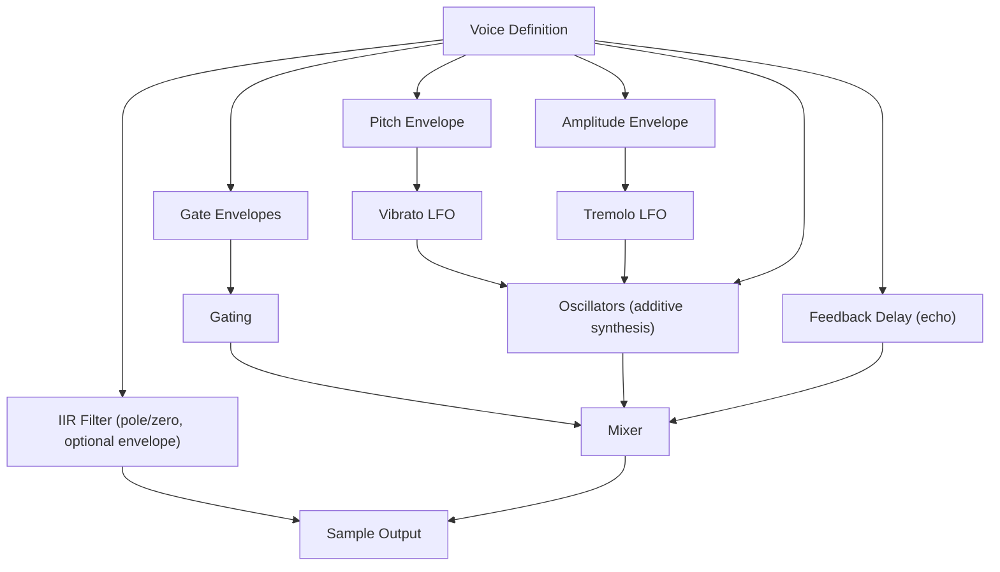

# Jagex .synth File Format Specification

Formal specification based on C# implementation (JagFX).

## Overview

Binary format for synthesized sound effects used in RuneScape. Contains up to **10 voices** with envelope-controlled pitch, amplitude, LFO modulation, and optional IIR filtering.

- **Byte Order**: Big Endian
- **Sample Rate**: 22,050 Hz (fixed)
- **Max Voices**: 10
- **Max Oscillators per Voice**: 10
- **Fixed-Point Scale**: 65,536 (16.16 format)

---

## Data Types

| Type | Size | Description |
|------|------|-------------|
| `u8` | 1 byte | Unsigned 8-bit integer |
| `u16` | 2 bytes | Unsigned 16-bit integer (big-endian) |
| `s32` | 4 bytes | Signed 32-bit integer (big-endian) |
| `smart` | 1-2 bytes | Signed variable-length integer. If value < 64: encoded as `val + 64`. If value >= 64: encoded as `((val + 49152) >> 8)` followed by `((val + 49152) & 0xFF)` |
| `usmart` | 1-2 bytes | Unsigned variable-length integer. If value < 128: encoded as `val`. If value >= 128: encoded as `((val >> 8) + 128)` followed by `(val & 0xFF)` |

---

## File Structure

```text
[Voice 0..9]        - Up to 10 voices, empty slots marked with 0x00
[Loop Parameters]   - 4 bytes (optional, may be truncated)
```

### Format Revisions

- **Rev245** (2004-07-13): Compact layout without padding
- **Rev377** (2006-05-02): Introduces 0x00 padding between voices

Parser detects format automatically and applies compatibility patches.

---

## Voice Structure

Each voice begins with a **marker byte**:

- `0x00`: Empty slot (consume 1 byte, advance to next)
- `!= 0x00`: Voice present (marker = Waveform ID of Pitch Envelope)

### Voice Fields

| Field | Type | Description |
|-------|------|-------------|
| **Pitch Envelope** | Envelope | Frequency trajectory over time |
| **Amplitude Envelope** | Envelope | Volume trajectory over time |
| **Vibrato LFO** | Optional Pair | Pitch modulation (Rate + Depth) |
| **Tremolo LFO** | Optional Pair | Amplitude modulation (Rate + Depth) |
| **Gate Envelopes** | Optional Pair | Silence + Duration control |
| **Oscillators** | Oscillator[] | Additive synthesis sources (0x00 terminated) |
| **Feedback Amount** | usmart | Echo feedback amount |
| **Feedback Mix** | usmart | Echo dry/wet balance |
| **Duration** | u16 | Total voice duration (ms) |
| **Start Time** | u16 | Delay before voice starts (ms) |
| **Filter** | Filter | Optional IIR filter (see below) |

### Optional Pair Detection

Peek next byte:

- `0x00`: Consume 1 byte, pair is absent
- `!= 0x00`: Read two Envelopes (Rate then Depth)

---

## Envelope Structure

| Field | Type | Description |
|-------|------|-------------|
| **Waveform** | u8 | `0`=Off, `1`=Square, `2`=Sine, `3`=Saw, `4`=Noise |
| **Start** | s32 | Initial value (fixed-point) |
| **End** | s32 | Final value (fixed-point) |
| **Segment Count** | u8 | Number of envelope segments |
| **Segments** | Segment[] | Linear interpolation points |

### Segment Structure

| Field | Type | Description |
|-------|------|-------------|
| **Duration** | u16 | Time to reach peak (ms) |
| **Peak** | u16 | Target value at segment end |

**Note**: Segment.Peak (0-65535) maps to progress between Start and End values.

---

## Oscillator Structure

Read until `0x00` terminator or max 10 oscillators:

| Field | Type | Description |
|-------|------|-------------|
| **Amplitude** | smart | Relative volume |
| **Pitch Offset** | smart | Fine pitch adjustment (decicents) |
| **Delay** | smart | Time before oscillator starts (ms) |

**Termination**: First byte of `0x00` indicates end of oscillator list.

---

## Filter Structure

IIR filter with configurable poles. Max 4 pole pairs per channel.

| Field | Type | Description |
|-------|------|-------------|
| **Channel Config** | u8 | Packed: `Count0 = byte >> 4`, `Count1 = byte & 0x0F` |
| **Unity Gain Ch0** | u16 | Gain for channel 0 |
| **Unity Gain Ch1** | u16 | Gain for channel 1 |
| **Modulation Mask** | u8 | Bit flags: `bit (ch*4+p)` indicates modulated pole |

### Pole Data

For each channel with `Count > 0`, read `Count` pairs:

| Field | Type | Description |
|-------|------|-------------|
| **Frequency** | u16 | Pole center frequency (Hz) |
| **Magnitude** | u16 | Pole magnitude (resonance) |

### Pole Modulation

If `Modulation Mask != 0`, for each modulated pole:

| Field | Type | Description |
|-------|------|-------------|
| **Freq Modulation** | u16 | Frequency modulation amount |
| **Mag Modulation** | u16 | Magnitude modulation amount |

### Filter Envelope

Read **only if** `Modulation Mask != 0`:

| Field | Type | Description |
|-------|------|-------------|
| **Segment Count** | u8 | Number of segments |
| **Segments** | Segment[] | Filter coefficient modulation over time |

**Note**: If `Channel Config == 0`, filter is absent.

---

## Loop Parameters

Optional 4-byte footer (may be truncated):

| Field | Type | Description |
|-------|------|-------------|
| **Loop Start** | u16 | Sample index where loop begins |
| **Loop End** | u16 | Sample index where loop ends |

**Truncation Handling**:

- If file ends before Loop: loop disabled (0, 0)
- If truncated during Voice: remaining voices are empty (null)

---

## Synthesis Signal Flow



---

## Constants

| Constant | Value | Description |
|----------|-------|-------------|
| SampleRate | 22050 | Audio sample rate (Hz) |
| MaxVoices | 10 | Maximum concurrent voices |
| MaxOscillators | 10 | Maximum oscillators per voice |
| MaxFilterPairs | 4 | Maximum pole pairs per filter channel |
| FilterUpdateRate | 256 | Samples between filter coefficient updates |
| FixedPoint.Scale | 65536 | 16.16 fixed-point multiplier |
| FixedPoint.Offset | 32768 | Fixed-point offset |

---

## Waveform IDs

| ID | Name | Description |
|----|------|-------------|
| 0 | Off | Silent output |
| 1 | Square | Square wave |
| 2 | Sine | Sine wave |
| 3 | Saw | Sawtooth wave |
| 4 | Noise | Random noise |

**Note**: IDs outside 0-4 treated as Off.

---

## Example File Layout

| Offset   | Content                | Description                          |
|----------|------------------------|--------------------------------------|
| 0x0000   | 01                     | Voice 0 marker (Square)              |
| 0x0001   | [Pitch Envelope]       | ~50-150 bytes                        |
| ...      | [Amplitude Envelope]   |                                      |
| ...      | [Vibrato LFO or 00]    |                                      |
| ...      | [Tremolo LFO or 00]    |                                      |
| ...      | [Gate Envelopes or 00] |                                      |
| ...      | [Oscillators]          | Terminated by 00                     |
| ...      | [Feedback params]      |                                      |
| ...      | [Duration, Start]      |                                      |
| ...      | [Filter or skip]       |                                      |
| 0x0???   | 00                     | Voice 1 marker (empty)               |
| 0x0???   | 00                     | Voice 2 marker (empty)               |
| ...      | ...                    | (Voices 3-9)                         |
| 0x????   | [u16 Loop Start]       | Loop begin (if present)              |
| 0x????   | [u16 Loop End]         | Loop end (if present)                |
